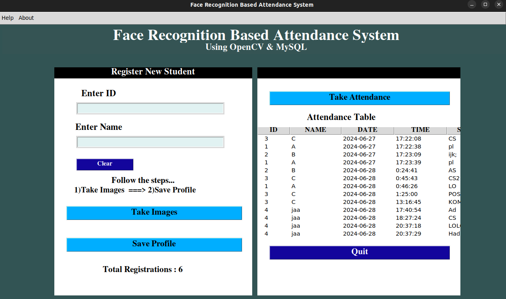
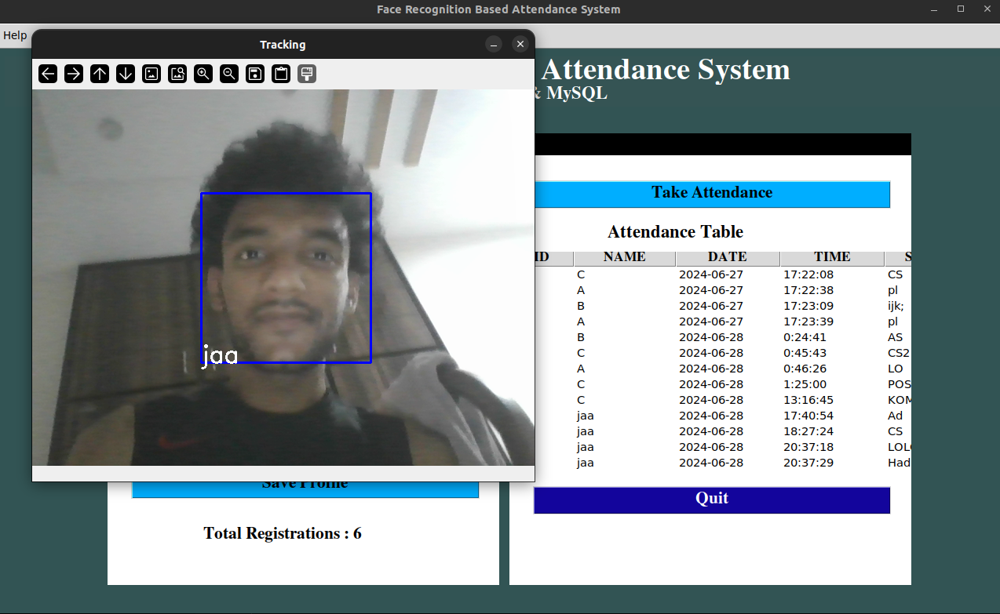

# Face Recognition Based Attendance System

This is a face recognition-based attendance system developed using Python, Tkinter, OpenCV, and MySQL. The system allows for the registration of students, taking their attendance, and storing the data in a MySQL database. 

## Features

- Register new students with their ID and Name.
- Capture images using a webcam.
- Train the system with the captured images.
- Recognize and mark attendance of students.
- Store and manage attendance records in a MySQL database.
- Change the admin password.

## Requirements
- Tkinter `pip install tk-tools`
- Python 3.10: [Download Python 3.10](https://www.python.org/downloads/release/python-3102/)
- PIL (Pillow): `pip install pillow`
- OpenCV: `pip install opencv-python`
- OpenCV Contrib (for face recognizer): `pip install opencv-contrib-python`
- MySQL Connector: `pip install mysql-connector-python`

## Installation

1. Clone the repository:
    ```bash
    git clone https://github.com/yourusername/facial-recognition-attendance-system.git
    cd facial-recognition-attendance-system
    ```

2. Install the required packages:
    ```bash
    pip install pillow opencv-python opencv-contrib-python mysql-connector-python
    ```

3. Set up your MySQL database:
    ```sql
    CREATE DATABASE attendance_db;
    CREATE USER 'attendance_user'@'localhost' IDENTIFIED BY 'attendance_password';
    GRANT ALL PRIVILEGES ON attendance_db.* TO 'attendance_user'@'localhost';
    ```

## How to Run


### On Windows

1. Ensure you have the necessary haarcascade file in the project directory:
    - `haarcascade_frontalface_default.xml`

2. Run the main application:
    ```bash
    python main.py
    ```

### On macOS

1. Install the required packages:
    ```bash
    pip install pillow opencv-python opencv-contrib-python mysql-connector-python
    ```

2. Ensure you have the necessary haarcascade file in the project directory:
    - `haarcascade_frontalface_default.xml`

3. If you encounter any issues with camera permissions, try running:
    ```bash
    python -m cv2
    ```

4. Run the main application:
    ```bash
    python main.py
    ```

## Usage

1. **Register New Student**: Enter the student ID and name, then click "Take Images" to capture their photos using the webcam.
2. **Save Profile**: Click "Save Profile" to train the system with the captured images.
3. **Take Attendance**: Click "Take Attendance" to start the face recognition process and mark attendance.
4. **View Attendance**: View attendance records in the table within the application.
5. **Change Password**: Use the "Change Password" option in the Help menu to change the admin password.
6. **Contact**: Use the "Contact Us" option in the Help menu for support.
7. **About**: Use the "About" option in the menu to view information about the system.

## Contributing

Feel free to fork this repository and contribute via pull requests. Any improvements and bug fixes are welcome





